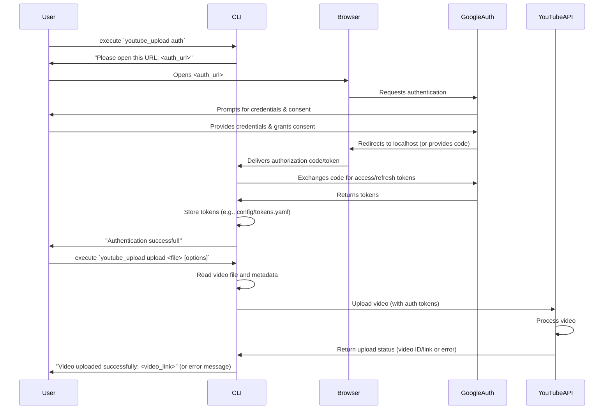

# YouTube Uploader CLI

A Ruby CLI tool to upload videos to YouTube and log the uploads.

## Architectural Overview

This project follows the principles of **Clean Architecture** to ensure a separation of concerns, testability, and adaptability. The main layers are:

\`\`\`mermaid
graph TD
    subgraph "Frameworks & Drivers (Outer Layer)"
        A1[CLI (Thor)]
        A2[Google API Client Gem]
        A3[File System]
        A4[Future: Rails UI]
        A5[Future: Database Adapters (PG, MySQL)]
    end

    subgraph "Interface Adapters (Gateways & Controllers)"
        B1[CLI Controller (app/cli)]
        B2[YouTubeServiceGateway (app/gateways)]
        B3[LogPersistenceGateway (app/gateways)]
    end

    subgraph "Application Business Rules (Use Cases)"
        C1[UploadVideoUseCase (app/use_cases)]
        C2[LogUploadDetailsUseCase (app/use_cases)]
    end

    subgraph "Enterprise Business Rules (Entities)"
        D1[VideoDetails (app/entities)]
        D2[UploadLogEntry (app/entities)]
    end

    %% Dependencies (Arrows point inwards)
    A1 --> B1
    A2 -.-> B2 %% Gem is used by Gateway Impl
    A3 -.-> B2 %% FS for video file
    A3 -.-> B3 %% FS for log file (initially)

    B1 --> C1
    B1 --> C2
    B2 --> C1 %% UseCase uses Gateway Interface
    B3 --> C1 %% UseCase uses Gateway Interface
    B3 --> C2 %% UseCase uses Gateway Interface

    C1 --> D1 %% UseCase uses Entity
    C1 --> D2 %% UseCase uses Entity (indirectly via LogUpload)
    C2 --> D2 %% UseCase uses Entity

    %% Future dependencies
    A4 -.-> C1
    A4 -.-> C2
    A5 -.-> B3

    style A1 fill:#f9f,stroke:#333,stroke-width:2px
    style A2 fill:#f9f,stroke:#333,stroke-width:2px
    style A3 fill:#f9f,stroke:#333,stroke-width:2px
    style A4 fill:#lightgrey,stroke:#333,stroke-width:2px,stroke-dasharray: 5 5
    style A5 fill:#lightgrey,stroke:#333,stroke-width:2px,stroke-dasharray: 5 5

    style B1 fill:#ccf,stroke:#333,stroke-width:2px
    style B2 fill:#ccf,stroke:#333,stroke-width:2px
    style B3 fill:#ccf,stroke:#333,stroke-width:2px

    style C1 fill:#9cf,stroke:#333,stroke-width:2px
    style C2 fill:#9cf,stroke:#333,stroke-width:2px

    style D1 fill:#9fc,stroke:#333,stroke-width:2px
    style D2 fill:#9fc,stroke:#333,stroke-width:2px

    linkStyle default interpolate basis
\`\`\`

**Key Principles:**

*   **Dependency Rule:** Dependencies only point inwards. Entities are at the core, followed by Use Cases, then Gateways, and finally Frameworks/Drivers on the outside.
*   **Abstractions:** Use Cases depend on Gateway *interfaces*, not concrete implementations. This allows flexibility (e.g., changing from a CSV logger to a database logger without altering the Use Case).
*   **Testability:** Each layer can be tested independently. Inner layers don't know about outer layers, making unit testing of business logic straightforward.

This structure is designed to make the application:
-   **Easy to maintain:** Changes in one area (e.g., UI or database) have minimal impact on others.
-   **Adaptable:** New features or integrations (like a Rails frontend or different database backends) can be added by creating new implementations for the outer layers or gateways without disrupting the core logic.
-   **Testable:** Core business logic is independent of external concerns.

## Usage

The CLI provides the following commands:

*   **`youtube_upload auth`**
    *   Authenticates the CLI with your Google account to allow YouTube uploads. It will guide you through an OAuth 2.0 flow.
    *   Upon successful authentication, tokens are typically stored in `config/tokens.yaml` (this path can be configured via environment variables).

*   **`youtube_upload upload FILE_PATH [options]`**
    *   Uploads the video specified by `FILE_PATH` to YouTube.
    *   **Options:**
        *   `-t, --title STRING`: Title of the video on YouTube.
        *   `-d, --description STRING`: Description of the video.
        *   `-c, --category_id STRING`: YouTube category ID (e.g., '22' for People & Blogs).
        *   `-p, --privacy_status STRING`: Privacy status: `public`, `private`, or `unlisted` (default: `private`).
        *   `-g, --tags ARRAY`: Comma-separated list of tags for the video (e.g., "tag1,tag two,tag3").

*   **`youtube_upload version`** (also `--version` or `-v`)
    *   Prints the version of the YouTube Uploader CLI.

*   **`youtube_upload help`** (also `-h`)
    *   Displays detailed usage information and available commands.

## User Flow



## Prerequisites

Before you begin, ensure you have the following installed:

*   **Ruby:** Version 2.7 or higher is recommended. You can check your version with `ruby -v`. (Installation: [https://www.ruby-lang.org/en/documentation/installation/](https://www.ruby-lang.org/en/documentation/installation/))
*   **Bundler:** This is a Ruby gem for managing application dependencies. You can install it with `gem install bundler`. (Installation: [https://bundler.io/](https://bundler.io/))

## Google Cloud Project Setup

To use this tool, you'll need to authorize it to access your YouTube account. This involves setting up a project on Google Cloud Platform and enabling the YouTube Data API.

1.  **Create or Select a Google Cloud Project:**
    *   Go to the [Google Cloud Console](https://console.cloud.google.com/).
    *   If you don't have an existing project, create a new one by clicking the project dropdown and then "New Project". Give it a descriptive name.

2.  **Enable the YouTube Data API v3:**
    *   In the Google Cloud Console, navigate to "APIs & Services" > "Library".
    *   Search for "YouTube Data API v3".
    *   Select it and click "Enable".

3.  **Create OAuth 2.0 Credentials:**
    *   Go to "APIs & Services" > "Credentials".
    *   Click "+ CREATE CREDENTIALS" and select "OAuth client ID".
    *   If prompted, you might need to configure the "OAuth consent screen" first:
        *   Choose "User Type" (likely "External" if you're testing with a personal account, or "Internal" if you're part of a Google Workspace organization).
        *   Fill in the required fields: App name (e.g., "Ruby YouTube Uploader CLI"), User support email, and Developer contact information. Click "SAVE AND CONTINUE" through the Scopes and Test users sections for now (scopes will be handled by the application).
    *   Once the consent screen is configured (or if you didn't need to), select "Desktop app" as the "Application type".
    *   Give your client ID a name (e.g., "YouTube Uploader CLI Desktop Client").
    *   Click "CREATE".

4.  **Download Client Secret JSON:**
    *   After creating the OAuth client ID, a dialog will show your Client ID and Client Secret. You don't need to copy these directly.
    *   Find your newly created "Desktop app" client in the "OAuth 2.0 Client IDs" list.
    *   Click the download icon (looks like a downward arrow) next to it. This will download a JSON file, usually named something like `client_secret_XXXXXXXXXXXX.json`.
    *   **Rename this file to `client_secret.json`**.
    *   **Place this `client_secret.json` file into the `config/` directory within this project.** (i.e., `youtube_uploader_cli/config/client_secret.json`)

    **Important Security Note:** The `client_secret.json` file contains sensitive credentials. It should **NEVER** be committed to version control. Ensure your project's `.gitignore` file includes `config/client_secret.json`.

## Environment Variables

This project uses a `.env` file to manage environment-specific configurations, such as API key paths and log file locations. This file is not committed to version control, allowing each user to have their own settings.

To set up your local environment:

1.  **Create a `.env` file:** In the root of the project (`youtube_uploader_cli/`), create a file named `.env`.
2.  **Copy from example:** Copy the contents from the `youtube_uploader_cli/.env.example` file into your new `.env` file.
3.  **Customize values:** Adjust the values in your `.env` file as needed for your setup. For example, you might set `GOOGLE_CLIENT_SECRET_PATH` if your client secret is not at `config/client_secret.json`, or `YOUTUBE_TOKENS_PATH` if you want to store tokens elsewhere.

The application uses the `dotenv` gem to automatically load these variables when it starts.
The `.env.example` file provides a template of all the environment variables the application recognizes:

*   `GOOGLE_CLIENT_SECRET_PATH`: Path to your Google OAuth 2.0 client secret JSON file. Default: `config/client_secret.json`.
*   `YOUTUBE_LOG_FILE_PATH`: Path where the CSV log file for uploads will be stored. Default: `log/upload_log.csv`. (Note: This can also be overridden by the `--log-path` option in the `upload` command).
*   `YOUTUBE_APP_NAME`: Application name used for YouTube API requests. Default: `Ruby YouTube Uploader CLI`.
*   `YOUTUBE_TOKENS_PATH`: Path to store the OAuth 2.0 access and refresh tokens. Default: `config/tokens.yaml`.
*   `YOUTUBE_UPLOADER_LOG_LEVEL`: Sets the logging level for the application.
    *   Purpose: Controls the verbosity of log output.
    *   Possible Values: `DEBUG`, `INFO`, `WARN`, `ERROR`.
    *   Default: `INFO` (if the variable is not set or an invalid value is provided).
    *   Example: `YOUTUBE_UPLOADER_LOG_LEVEL=DEBUG` for more detailed output.

## Debugging

If you encounter issues while using the YouTube Uploader CLI, here are some steps to help diagnose the problem:

### 1. Check Environment Variables

*   **Verify `.env` File**: Ensure you have a `.env` file in the project root (`youtube_uploader_cli/.env`). If not, copy it from `.env.example` and customize it.
*   **Client Secret Path**: Double-check the `GOOGLE_CLIENT_SECRET_PATH` in your `.env` file. Make sure it correctly points to your `client_secret.json` file. The default is `config/client_secret.json`. Ensure the JSON file itself is valid and obtained from the Google Cloud Console.

### 2. Enable Detailed Logging

*   **Set Log Level to DEBUG**: To get the most detailed log output from the application, set the `YOUTUBE_UPLOADER_LOG_LEVEL` environment variable in your `.env` file:
    ```
    YOUTUBE_UPLOADER_LOG_LEVEL=DEBUG
    ```
*   **Log Output**: Application logs (controlled by `YOUTUBE_UPLOADER_LOG_LEVEL`) are sent to STDOUT (your console). When set to `DEBUG`, this will include detailed information about gateway operations, API calls (if implemented in gateways), and use case execution steps.

### 3. Authentication Issues (`youtube_upload auth`)

*   **Re-run Authentication**: Try running `youtube_upload auth` again. Follow the on-screen prompts carefully.
*   **Check Console Output**: Look for any error messages or specific instructions printed in the console during the `auth` command.
*   **Token File**:
    *   The application stores authentication tokens in the file specified by `YOUTUBE_TOKENS_PATH` (default: `config/tokens.yaml`).
    *   If you suspect corrupted tokens, you can try deleting this file and re-running `youtube_upload auth` to start the authentication process from scratch.

### 4. Upload Issues (`youtube_upload upload ...`)

*   **Check Console Output**: When an upload fails, the CLI should print an error message to the console. This is often the first indicator of what went wrong.
*   **Consult CSV Audit Log**:
    *   The application maintains a CSV log of all upload attempts. This log is stored at the path specified by `YOUTUBE_LOG_FILE_PATH` in your `.env` file (default: `logs/upload_log.csv`), or the path provided via the `--log-path` option during the `upload` command.
    *   This log records the `video_title`, `file_path`, `youtube_url` (if successful), `upload_date`, `status` ('SUCCESS' or 'FAILURE'), and `details` (which includes the YouTube Video ID on success or an error message on failure). Review this log for specific error messages related to past uploads.

### 5. Consult Detailed Application Logs

*   As mentioned in "Enable Detailed Logging," setting `YOUTUBE_UPLOADER_LOG_LEVEL=DEBUG` is crucial.
*   These detailed logs (printed to STDOUT) can provide insights into:
    *   The data being sent to the YouTube API (e.g., video metadata).
    *   Responses received from the YouTube API (e.g., error messages, status codes).
    *   The flow of data through different components of the application.
    *   Specific error messages from gateways (like `CliYouTubeServiceGateway` or `CsvLogPersistenceGateway`).
