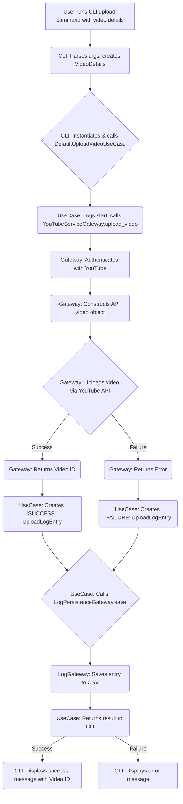

# User Flow: Video Upload

This document outlines the user flow for uploading a video using the YouTube Uploader CLI.

## Diagram

## Steps Explained

1.  **User Initiates Upload:** The user runs the CLI command (`youtube_upload upload ...`) providing video details (file path, title, description, etc.).
    *   The **CLI** (`app/cli/main.rb`) parses these arguments and creates a `VideoDetails` entity.

2.  **Orchestrate Upload:** The **CLI** instantiates and invokes the `DefaultUploadVideoUseCase`, passing the `VideoDetails`.

3.  **Execute Upload:**
    *   The **`DefaultUploadVideoUseCase`** calls `upload_video` on the `CliYouTubeServiceGateway`.
    *   The **`CliYouTubeServiceGateway`**:
        *   Ensures authentication with YouTube.
        *   Constructs the necessary video object for the API.
        *   Attempts to upload the video file and metadata via the Google YouTube API.
        *   Returns the outcome (video ID on success, error details on failure) to the use case.

4.  **Log Upload Attempt:**
    *   The **`DefaultUploadVideoUseCase`** creates an `UploadLogEntry` entity reflecting the outcome (success/failure, video ID or error message).
    *   It then calls `save` on the `LogPersistenceGateway`.
    *   The **`LogPersistenceGateway`** (e.g., `CsvLogPersistenceGateway`) writes this entry to the audit log (e.g., `upload_log.csv`).

5.  **Feedback to User:**
    *   The **`DefaultUploadVideoUseCase`** returns the overall result to the **CLI**.
    *   The **CLI** displays a user-friendly message indicating success (including the YouTube video ID) or failure.

Throughout this process, all key components (CLI, Use Case, Gateways) use a shared Logger to record detailed information about their operations.
