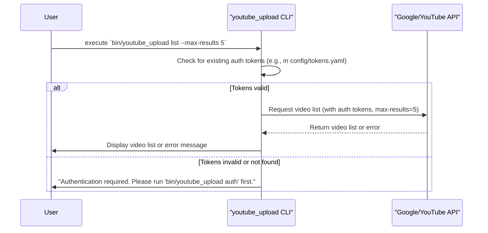

# Feature: List YouTube Videos

This document describes the `list` command for the YouTube Uploader CLI, which allows users to list videos from their YouTube account.

## Prerequisites

Before using the `list` command, ensure you have:

1.  **Set up your development environment:**
    *   Installed Ruby (version 2.7+ recommended).
    *   Installed Bundler (`gem install bundler`).
    *   For detailed instructions, see the [main README.md#Prerequisites](../../README.md#prerequisites).
2.  **Configured your Google Cloud Project:**
    *   Created a Google Cloud Project.
    *   Enabled the **YouTube Data API v3**.
    *   Created **OAuth 2.0 Credentials** for a "Desktop app".
    *   Downloaded the client secret JSON file.
    *   For detailed steps, refer to the [Google Cloud Project Setup section in the main README.md](../../README.md#google-cloud-project-setup).

## Setup Instructions

To use the `list` command, follow these steps:

1.  **Clone the Repository:**
    ```bash
    git clone <repository_url> # Replace <repository_url> with the actual URL
    cd youtube_uploader_cli
    ```
2.  **Install Dependencies:**
    Run Bundler to install the required gems.
    ```bash
    bundle install
    ```
3.  **Place Client Secret:**
    *   Rename your downloaded OAuth 2.0 client secret JSON file to `client_secret.json`.
    *   Place this file in the `config/` directory (i.e., `youtube_uploader_cli/config/client_secret.json`).
    *   **Important:** This file should NOT be committed to version control. Ensure `config/client_secret.json` is in your `.gitignore` file.
    *   For more details, see the [Download Client Secret JSON section in README.md](../../README.md#download-client-secret-json).
4.  **Configure Environment Variables:**
    *   Create a `.env` file in the `youtube_uploader_cli/` directory by copying `.env.example`:
        ```bash
        cp .env.example .env
        ```
    *   Review and customize the variables in `.env` if needed. The default settings for `GOOGLE_CLIENT_SECRET_PATH` and `YOUTUBE_TOKENS_PATH` should work if you've followed the steps above.
    *   For more details, see the [Environment Variables section in README.md](../../README.md#environment-variables).
5.  **Authenticate with Google:**
    Run the `auth` command to authorize the CLI to access your YouTube account. This will open a URL in your browser, and you'll need to copy a code back to the terminal.
    ```bash
    bin/youtube_upload auth
    ```
    Upon successful authentication, your tokens will be stored (by default in `config/tokens.yaml`).

## Command Usage

Once authenticated, you can list videos from your YouTube account using the `list` command:

```bash
bin/youtube_upload list [options]
```

### Options

*   `-m, --max-results NUMBER`: Specifies the maximum number of videos to retrieve (e.g., `5`). The default is 10. The YouTube API typically allows a maximum of 50.
*   `-h, --help`: Displays detailed help information for the `list` command.

## Functionality

The `list` command performs the following actions:

1.  **Authentication Check**: It checks for existing authentication tokens. If valid tokens are found, it proceeds. If not, or if they are expired, it will instruct you to run `bin/youtube_upload auth` again or handle re-authentication if implemented for expired tokens.
2.  **Fetch Videos**: Once authenticated, it calls the YouTube Data API v3 to retrieve a list of videos uploaded by the authenticated user, respecting the `--max-results` option.
3.  **Display Videos**: The command then prints a formatted list of the retrieved videos to the console, including:
    *   A sequential number.
    *   The video title.
    *   The YouTube URL for the video.
    *   The date the video was published.

## Example

To list the latest 5 videos from your account after completing the setup and authentication:

```bash
bin/youtube_upload list --max-results 5
```

### Example Output:

```
Fetching video list...
Your Videos:
1. My Awesome Trip - https://www.youtube.com/watch?v=VIDEO_ID_1 (Published: 2023-10-26)
2. Cooking Adventures - https://www.youtube.com/watch?v=VIDEO_ID_2 (Published: 2023-10-20)
# ... and so on for up to 5 videos
```

If you haven't authenticated yet, or if your tokens are invalid, you might see:
```
Authentication required. Please run 'bin/youtube_upload auth' first.
```
or it might attempt to re-authenticate.

## Error Handling

*   If authentication fails or tokens are missing/invalid, an informative error message will be displayed.
*   If an error occurs while fetching videos from the YouTube API (e.g., API quota exceeded, network issues), an error message from the API or the application will be shown.
*   If no videos are found on the account, a message such as "No videos found on your account." will be displayed.

## User Flow for `list` Command



This diagram shows the typical flow for the `list` command. If authentication tokens are missing or invalid, the user is prompted to authenticate. Otherwise, the CLI interacts with the YouTube API to fetch and display the video list. For the initial authentication flow, please refer to the `auth` command documentation or the main [README.md](../../README.md#user-flow).

## Codebase Structure for `list` Command

This diagram shows the main components involved when you run the `list` command:

```mermaid
graph TD
    subgraph "CLI Interface"
        A1[Thor CLI (bin/youtube_upload)]
    end

    subgraph "Application Layer"
        B1[App::CLI::Main (app/cli/main.rb)]
        C1[ListVideosUseCase (app/use_cases/list_videos_use_case.rb)]
    end

    subgraph "Gateway Layer"
        D1[YouTubeServiceGateway (app/gateways/youtube_service_gateway.rb)]
        D2[CliYouTubeServiceGateway (app/gateways/cli_youtube_service_gateway.rb)]
    end

    subgraph "Entities Layer"
        E1[VideoListItem (app/entities/video_list_item.rb)]
    end

    subgraph "External Services"
        F1[Google API Client Gem]
        G1[YouTube Data API v3]
    end

    A1 -- calls --> B1
    B1 -- invokes 'list' command --> C1
    C1 -- uses --> D1
    D1 -- implemented by --> D2
    D2 -- uses --> F1
    F1 -- interacts with --> G1
    C1 -- returns list of --> E1
    D2 -- constructs --> E1

    style A1 fill:#f9f,stroke:#333,stroke-width:2px
    style B1 fill:#ccf,stroke:#333,stroke-width:2px
    style C1 fill:#9cf,stroke:#333,stroke-width:2px
    style D1 fill:#aaf,stroke:#333,stroke-width:2px
    style D2 fill:#aaf,stroke:#333,stroke-width:2px
    style E1 fill:#9fc,stroke:#333,stroke-width:2px
    style F1 fill:#f9f,stroke:#333,stroke-width:2px
    style G1 fill:#f9f,stroke:#333,stroke-width:2px
```

This diagram illustrates how the command initiated by the user flows through the CLI, into the application's use case, which then utilizes a gateway (and its concrete implementation) to interact with the external Google API. The results are then formed into entities and passed back up.
```
