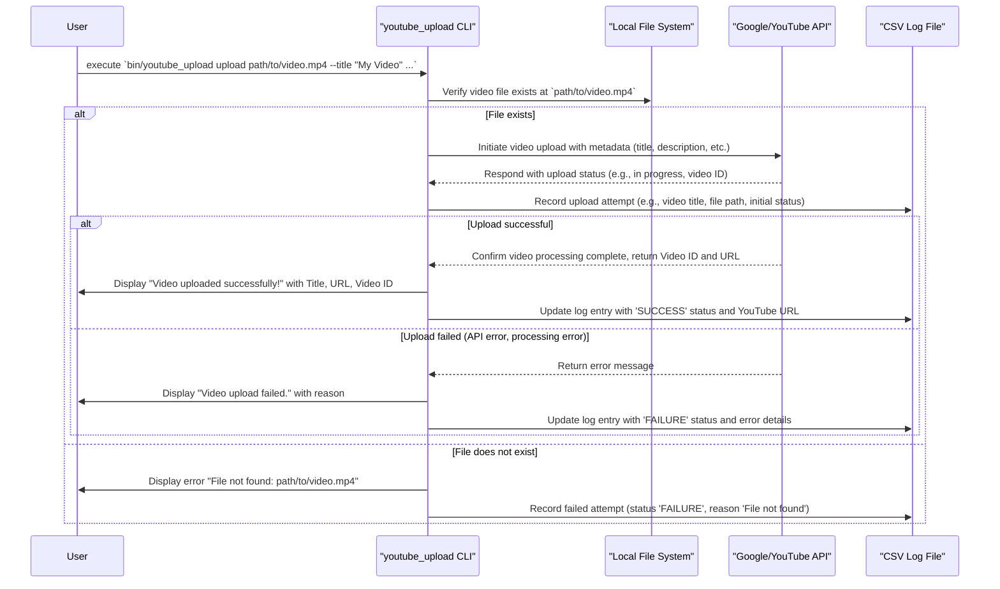

## Prerequisites

Before using the `upload` command, ensure you have:

1.  **Set up your development environment:**
    *   Installed Ruby (version 2.7+ recommended).
    *   Installed Bundler (`gem install bundler`).
    *   For detailed instructions, see the [main README.md#Prerequisites](../../README.md#prerequisites).
2.  **Configured your Google Cloud Project:**
    *   Created a Google Cloud Project.
    *   Enabled the **YouTube Data API v3**.
    *   Created **OAuth 2.0 Credentials** for a "Desktop app".
    *   Downloaded the client secret JSON file.
    *   For detailed steps, refer to the [Google Cloud Project Setup section in the main README.md](../../README.md#google-cloud-project-setup).

## Setup Instructions

To use the `upload` command, follow these steps:

1.  **Clone the Repository:**
    ```bash
    git clone <repository_url> # Replace <repository_url> with the actual URL
    cd youtube_uploader_cli
    ```
2.  **Install Dependencies:**
    Run Bundler to install the required gems.
    ```bash
    bundle install
    ```
3.  **Place Client Secret:**
    *   Rename your downloaded OAuth 2.0 client secret JSON file to `client_secret.json`.
    *   Place this file in the `config/` directory (i.e., `youtube_uploader_cli/config/client_secret.json`).
    *   **Important:** This file should NOT be committed to version control. Ensure `config/client_secret.json` is in your `.gitignore` file.
    *   For more details, see the [Download Client Secret JSON section in README.md](../../README.md#download-client-secret-json).
4.  **Configure Environment Variables:**
    *   Create a `.env` file in the `youtube_uploader_cli/` directory by copying `.env.example`:
        ```bash
        cp .env.example .env
        ```
    *   Review and customize the variables in `.env`. Key variables for uploading include:
        *   `GOOGLE_CLIENT_SECRET_PATH` (default should be `config/client_secret.json`)
        *   `YOUTUBE_TOKENS_PATH` (default should be `config/tokens.yaml`)
        *   `UPLOAD_LOG_PATH` (optional, defaults to `upload_log.csv` in the project root)
    *   For more details, see the [Environment Variables section in README.md](../../README.md#environment-variables).
5.  **Authenticate with Google:**
    Run the `auth` command to authorize the CLI to access your YouTube account. This will open a URL in your browser, and you'll need to copy a code back to the terminal.
    ```bash
    bin/youtube_upload auth
    ```
    Upon successful authentication, your tokens will be stored (by default in `config/tokens.yaml`). This step is crucial before you can upload videos.

## Command Usage

Once authenticated, you can upload a video using the `upload` command:

```bash
bin/youtube_upload upload FILE_PATH [options]
```

### Positional Arguments

*   `FILE_PATH`: (Required) The path to the video file you want to upload.

### Options

*   `-t, --title STRING`: (Required) Specifies the title of the video on YouTube.
*   `-d, --description STRING`: Specifies the description for the video. If not provided, it might default to an empty string or a predefined template depending on the API's behavior.
*   `-c, --category_id STRING`: (Required) The YouTube category ID for the video (e.g., '22' for People & Blogs, '10' for Music, '28' for Science & Technology). You can find a list of category IDs in the YouTube Data API documentation.
*   `-p, --privacy_status STRING`: Sets the privacy status of the video.
    *   Allowed values: `public`, `private`, `unlisted`.
    *   Defaults to `unlisted`.
*   `-g, --tags ARRAY`: A comma-separated list of tags for the video (e.g., "tag1,tag two,tag3").
*   `--log_path STRING`: Specifies a custom path for the CSV file where upload logs will be saved. If not provided, logs are saved to `upload_log.csv` in the root directory of the `youtube_uploader_cli` project.
*   `-h, --help`: Displays detailed help information for the `upload` command.

## Functionality

The `upload` command performs the following actions:

1.  **Authentication Check**: It relies on previously acquired authentication tokens (via the `auth` command). If valid tokens are not present or have expired, the underlying YouTube API calls will likely fail, and the Google API client library might raise an error.
2.  **Video Processing**: It takes the provided `FILE_PATH` and prepares the video for upload.
3.  **Metadata Application**: It applies the metadata provided via options (title, description, category ID, privacy status, tags) to the video.
4.  **YouTube API Interaction**: It uses the YouTube Data API v3 to upload the video to the authenticated user's YouTube channel.
5.  **Logging**:
    *   It records the outcome of each upload attempt (success or failure) in a CSV log file.
    *   By default, this log is saved to `upload_log.csv` in the `youtube_uploader_cli` project directory. This path can be customized using the `--log_path` option.
    *   The log includes details such as the video title, file path, YouTube URL (if successful), status, and any error messages.
6.  **Console Output**:
    *   It prints the status of the upload to the console.
    *   On successful upload, it displays the video title, the YouTube URL, and the Video ID.
    *   On failure, it displays an error message indicating the reason.

## Example

To upload a video named `my_cool_video.mp4` located in the `videos/` directory, with a specific title, description, category, and tags, after completing the setup and authentication:

```bash
bin/youtube_upload upload videos/my_cool_video.mp4 \
  --title "My Awesome Vacation Adventure" \
  --description "A short film about my recent trip to the mountains. Hope you enjoy!" \
  --category_id "19" \
  --privacy_status "private" \
  --tags "vacation,adventure,mountains,travel"
```
*(Note: `19` is typically the category ID for "Travel & Events". You should verify category IDs from YouTube's official documentation.)*

### Example Success Output:

```
Video uploaded successfully!
Title: My Awesome Vacation Adventure
YouTube URL: https://www.youtube.com/watch?v=VIDEO_ID_EXAMPLE
Video ID: VIDEO_ID_EXAMPLE
```

### Example Failure Output (e.g., file not found):

```
Video upload failed.
Title: My Awesome Vacation Adventure
Reason: File not found: videos/my_cool_video.mp4
```

### Example Failure Output (e.g., missing required option):
```
ERROR: Invalid video details provided. Title is required.
```

(The exact error messages might vary based on the specific failure condition.)

## Error Handling

*   **Authentication Issues**:
    *   If you haven't run `bin/youtube_upload auth` or if your tokens are invalid/expired, the upload will likely fail. You'll see errors related to authorization or authentication.
    *   **Solution**: Run `bin/youtube_upload auth` to (re-)authenticate.
*   **File Not Found**:
    *   If the `FILE_PATH` provided does not point to an existing file, the command will fail.
    *   **Solution**: Ensure the file path is correct and the file exists.
*   **Missing Required Options**:
    *   The command will fail if required options like `--title` or `--category_id` are not provided. An error message will indicate which option is missing.
    *   **Solution**: Provide all required options with valid values.
*   **Invalid Video Metadata**:
    *   Providing an invalid `category_id` or an unsupported `privacy_status` value can lead to API errors.
    *   **Solution**: Refer to YouTube Data API documentation for valid `category_id` values and ensure `privacy_status` is one of `public`, `private`, or `unlisted`.
*   **YouTube API Errors**:
    *   Errors from the YouTube API can occur due to various reasons, such as:
        *   **Quota Exceeded**: You might have exceeded your daily API usage quota.
        *   **Permissions Denied**: The authenticated user might not have permission to upload videos to the channel.
        *   **Video Too Long/Large**: The video might exceed YouTube's limits.
        *   **Processing Failed**: YouTube might fail to process the uploaded video.
    *   The CLI will attempt to display the error message from the API.
    *   **Solution**: Check the specific error message. You might need to wait for your quota to reset, verify account permissions, or check YouTube's upload guidelines.
*   **Logging Errors**:
    *   In rare cases, the CLI might fail to write to the log file (e.g., due to file permissions). The upload itself might still succeed or fail, but the logging part would encounter an issue.
    *   **Solution**: Check file permissions for the log file path.
*   **Network Issues**:
    *   Unstable internet connectivity can interrupt the upload process.
    *   **Solution**: Ensure you have a stable internet connection.

## User Flow for `upload` Command

This diagram illustrates the typical user flow when executing the `upload` command, assuming prior successful authentication using the `auth` command.



This diagram shows the steps involved from the user initiating the command to the video being uploaded (or failing) and the results being logged and displayed. For the initial authentication flow, please refer to the `auth` command documentation or the main [README.md](../../README.md#user-flow).

## Codebase Structure for `upload` Command

This diagram shows the main components involved when you run the `upload` command:

```mermaid
graph TD
    subgraph "CLI Interface"
        A1[Thor CLI (bin/youtube_upload)]
    end

    subgraph "Application Layer (Use Cases)"
        B1[App::CLI::Main (app/cli/main.rb)]
        C1[DefaultUploadVideoUseCase (app/use_cases/default_upload_video.rb)]
    end

    subgraph "Gateway Layer"
        D1[CliYouTubeServiceGateway (app/gateways/cli_youtube_service_gateway.rb)]
        D2[CsvLogPersistenceGateway (app/gateways/csv_log_persistence_gateway.rb)]
        D3[YouTubeServiceGateway (app/gateways/youtube_service_gateway.rb) - Interface]
        D4[LogPersistenceGateway (app/gateways/log_persistence_gateway.rb) - Interface]
    end

    subgraph "Entities Layer"
        E1[VideoDetails (app/entities/video_details.rb)]
        E2[UploadLogEntry (app/entities/upload_log_entry.rb)]
    end

    subgraph "External Services & Libraries"
        F1[Google API Client Gem]
        G1[YouTube Data API v3]
        H1[CSV Library (for logging)]
    end

    A1 -- invokes 'upload' command --> B1
    B1 -- instantiates and calls --> C1
    B1 -- instantiates --> D1
    B1 -- instantiates --> D2
    B1 -- creates --> E1

    C1 -- uses (interface) --> D3
    C1 -- uses (interface) --> D4
    C1 -- processes --> E1
    C1 -- creates and returns --> E2

    D3 -- implemented by --> D1
    D4 -- implemented by --> D2

    D1 -- uses --> F1
    F1 -- interacts with --> G1
    D2 -- uses --> H1

    style A1 fill:#f9f,stroke:#333,stroke-width:2px
    style B1 fill:#ccf,stroke:#333,stroke-width:2px
    style C1 fill:#9cf,stroke:#333,stroke-width:2px
    style D1 fill:#aaf,stroke:#333,stroke-width:2px
    style D2 fill:#aaf,stroke:#333,stroke-width:2px
    style D3 fill:#c9c,stroke:#333,stroke-width:1px,stroke-dasharray: 5 5
    style D4 fill:#c9c,stroke:#333,stroke-width:1px,stroke-dasharray: 5 5
    style E1 fill:#9fc,stroke:#333,stroke-width:2px
    style E2 fill:#9fc,stroke:#333,stroke-width:2px
    style F1 fill:#f9f,stroke:#333,stroke-width:2px
    style G1 fill:#f9f,stroke:#333,stroke-width:2px
    style H1 fill:#f9f,stroke:#333,stroke-width:2px
```

This diagram illustrates how the `upload` command initiated by the user flows through the CLI handler (`Main`), into the specific use case (`DefaultUploadVideoUseCase`). The use case then utilizes gateways (concrete implementations `CliYouTubeServiceGateway` and `CsvLogPersistenceGateway` for their respective interfaces) to interact with external services (YouTube API) and internal mechanisms (CSV logging). Data is passed around using entities (`VideoDetails`, `UploadLogEntry`).
